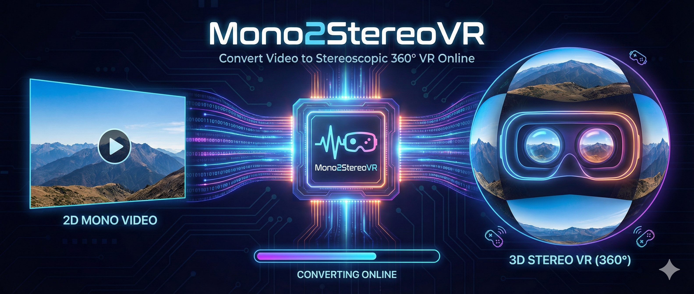

# Mono2StereoVR



Convert monoscopic 360° videos to stereoscopic VR experiences. Upload or paste a YouTube/Vimeo URL and experience immersive VR viewing on desktop, mobile with Google Cardboard, or VR headsets.

## Features

- **360° Video Support**: View panoramic videos in full immersion
- **Stereo Rendering**: Dual-eye split-view stereoscopic rendering for VR headsets
- **Multiple Input Methods**: 
  - YouTube/Vimeo URL ingestion with yt-dlp
  - File upload for local video files
- **VR Modes**:
  - **Desktop Mode**: Centered viewport with mouse/keyboard controls
  - **Cardboard Mode**: Full-screen stereo rendering optimized for Google Cardboard
  - **Gyroscope Support**: Device orientation tracking on mobile devices
- **Interactive Controls**:
  - Look around with mouse drag or arrow keys
  - Gyroscope-responsive orientation tracking
  - Recenter/reset view button
  - Toggleable UI for immersive viewing
  - Zoom/fit controls

## Tech Stack

### Frontend
- **Framework**: Next.js 15.1.6
- **Language**: TypeScript 5.7.3
- **3D Rendering**: Three.js 0.173.0
- **Runtime**: React 19.0.0

### Backend
- **Framework**: FastAPI 0.115.8
- **Server**: Uvicorn 0.34.0
- **Video Downloads**: yt-dlp 2026.2.4
- **Language**: Python 3.12.4
- **Runtime**: Python venv

### Infrastructure
- **Containerization**: Docker & Docker Compose
- **Static Serving**: FastAPI mount for `/storage` directory
- **Media Storage**: Local filesystem (`/storage/uploads/`, `/storage/url-imports/`)

## Project Structure

```
Mono2StereoVR/
├── frontend/                    # Next.js React app (port 3000)
│   ├── app/
│   │   ├── page.tsx            # Homepage with intake UI
│   │   ├── player/
│   │   │   └── [jobId]/page.tsx # Job viewer/player page
│   │   ├── globals.css          # Global styles (neon cyberpunk theme)
│   │   └── layout.tsx           # Root HTML shell
│   ├── components/
│   │   └── Player360.tsx        # Core 360° viewer with stereo rendering
│   ├── public/
│   │   └── banner.png           # Homepage banner image
│   └── package.json
├── backend/                     # FastAPI Python app (port 8000)
│   └── app/
│       └── main.py              # API endpoints & job pipeline
├── storage/                     # Media storage
│   ├── uploads/                 # User-uploaded videos
│   └── url-imports/             # Downloaded videos from URLs
├── docker-compose.yml           # Local dev orchestration
├── .gitignore                   # Git ignore rules
└── README.md                    # This file
```

## Getting Started

### Prerequisites
- Docker & Docker Compose, **OR**
- Node.js 18+ and Python 3.11+

### Option 1: Docker Compose (Recommended)

```bash
docker-compose up
```

Access:
- Frontend: http://localhost:3000
- Backend API: http://localhost:8000
- API Docs: http://localhost:8000/docs

### Option 2: Manual Setup

#### Backend
```bash
cd backend
python -m venv venv
source venv/bin/activate  # Windows: venv\Scripts\activate
pip install -r requirements.txt
uvicorn app.main:app --reload --port 8000
```

#### Frontend
```bash
cd frontend
npm install
npm run dev
```

Access: http://localhost:3000

## API Endpoints

### Create Job from URL
```
POST /api/v1/ingest/url
Content-Type: application/json

{
  "url": "https://vimeo.com/...",
  "ownershipConfirmed": true
}
```

Returns job with ID and status.

### Upload Video File
```
POST /api/v1/upload
Content-Type: multipart/form-data

[binary video file]
```

Returns job with ID and status.

### Get Job Status
```
GET /api/v1/jobs/<jobId>
```

Returns:
```json
{
  "id": "job-uuid",
  "status": "complete|downloading|depth_estimation|stereo_synthesis|encoding|failed",
  "streamUrl": "/storage/url-imports/job-uuid/output.mp4",
  "errorMessage": null
}
```

### Stream Video
```
GET /storage/<path-to-video>
```

Serves video files with proper HTTP streaming headers.

## Rendering Modes

### Desktop Mode
- Centered viewport with 16:9 aspect ratio
- Mouse drag + arrow keys for look-around
- Gyroscope support on compatible devices
- Translucent control panel with hide/show toggle

### Cardboard Mode
- Full-screen (100vw × 100vh) stereo split-view
- Dual eye cameras with yaw offset for stereoscopic depth
- Gyroscope-driven orientation tracking
- Minimal overlay UI (toggleable)
- Optimized for Google Cardboard / mobile VR

## How It Works

1. **Video Ingestion**: User provides YouTube/Vimeo URL or uploads video file
2. **Job Creation**: Backend creates job with UUID and queues processing
3. **Downloading**: For URLs, yt-dlp downloads media and stores locally
4. **Depth Estimation** (simulated): Mono source is prepared
5. **Stereo Synthesis** (simulated): Dual-eye cameras apply offsets
6. **Encoding** (simulated): Video is encoded for streaming
7. **Streaming**: Frontend player fetches video via API and renders to canvas
8. **Viewing**: User can toggle between desktop and Cardboard modes, control with mouse/keyboard/gyroscope

## Future Enhancements

- [ ] AI-based depth estimation (MonoDepth2, MiDaS)
- [ ] DIBR (Depth Image-Based Rendering) for true stereo synthesis
- [ ] HLS/DASH adaptive bitrate streaming
- [ ] WebXR Immersive Session API support
- [ ] Celery + Redis job queue for production scaling
- [ ] AWS S3 / cloud video storage
- [ ] Analytics and usage tracking

## Theme

The interface follows a **cyberpunk neon aesthetic** with:
- Deep navy background (#0a0e27)
- Cyan primary accent (#00d9ff) with glow effects
- Magenta secondary accent (#ff006e)
- Uppercase typography with letter-spacing
- Glowing borders and hover states

## License

MIT

## Contact

For questions or contributions, reach out via GitHub Issues.

---

Built with ❤️ for immersive VR experiences
